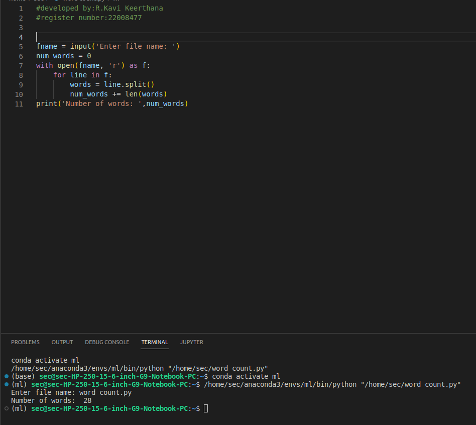

# Word-count
## AIM:
To write a python program for getting the word count from a text.
## EQUIPEMENT'S REQUIRED: 
PC
Anaconda - Python 3.7

# ALGORITHM: 

### Step 1:

Import sys

### Step 2: 

Get the input values as given
 
### Step 3: 

Write a program for getting the word count from a text

### Step 4:  

Find the word count from a text

### Step 6: 

Emd the program


## PROGRAM:
```python
#developed by:R.Kavi Keerthana
#register number:22008477


fname = input('Enter file name: ')
num_words = 0
with open(fname, 'r') as f:
    for line in f:
        words = line.split()
        num_words += len(words)
print('Number of words: ',num_words)
```

### OUTPUT:



## RESULT:
Thus the program is written to find the word count from a text.
